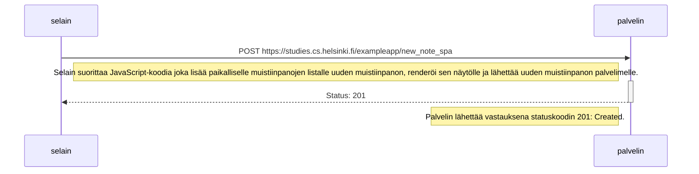

```mermaid
sequenceDiagram
    participant selain
    participant palvelin

    selain->>palvelin: POST https://studies.cs.helsinki.fi/exampleapp/new_note_spa

    Note right of selain: Selain suorittaa JavaScript-koodia joka lisää paikalliselle muistiinpanojen listalle uuden muistiinpanon, renderöi sen näytölle ja lähettää uuden muistiinpanon palvelimelle.
    
    activate palvelin
    palvelin-->>selain: Status: 201
    deactivate palvelin

    Note left of palvelin: Palvelin lähettää vastauksena statuskoodin 201: Created.
```
